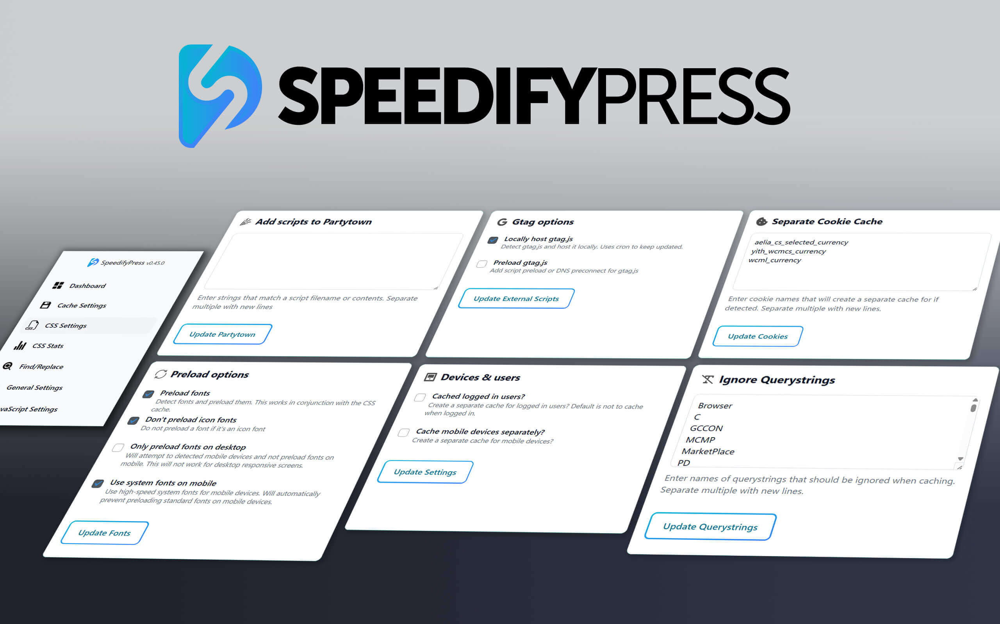
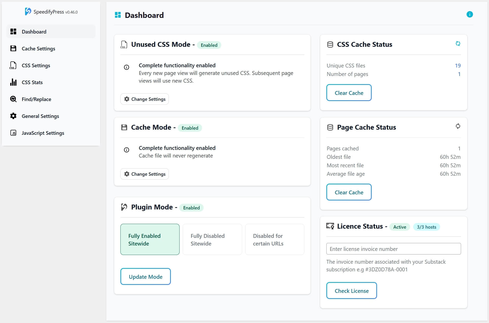

# SpeedifyPress - Real-World WP Speed, Engineered for Pros

SpeedifyPress is a performance optimization toolkit for WordPress, built for developers and agencies who need real-world speed and precision control. Combining advanced techniques with practical configurability, SpeedifyPress goes beyond typical plugins to deliver fast, scalable, and reliable results — all without compromising compatibility or flexibility. From smart unused CSS handling to Cloudflare-ready caching, it's your personal speed stack, engineered for you.

# 🔑 Key Capabilities

- **Unused CSS Handling (Done Right)**  
  Smart removal of unused CSS with a custom approach that avoids common pitfalls of other solutions.

- **Advanced Page Caching**  
  Cache pages with full support for language/currency plugins, background processing, and seamless Cloudflare integration.

- **Configurable JavaScript Delay**  
  Delay JavaScript (including jQuery!) for better performance — with fine-tuned control for real-world use cases.

- **Local Google Analytics (gtag.js)**  
  Serve Google Analytics locally for faster load times and better privacy.

- **Partytown Integration**  
  Move third-party scripts to web workers for minimal main thread impact.

- **Image Lazyloading + Preload**  
  Lazyload images with a custom preloader and automatically preload your LCP image for faster perceived load.

- **HTML Lazyloading**  
  Defer rendering of below-the-fold HTML for a faster initial paint.

- **HTML Find/Replace**  
  Modify your site's HTML on-the-fly with advanced find/replace rules — ideal for agency or power users.

- **Cloudflare Worker Script**  
  Use a custom Cloudflare Worker for intelligent, edge-level caching — with an easy way to clear the cache.

- **Expert Font Loading**  
  Automatically preload the right fonts and fall back to fast system fonts on mobile where appropriate.

## ⚡ Quick Start

1. **Subscribe to the Newsletter**  
   SpeedifyPress is available exclusively to subscribers. Subscribe at the [Adventures in WordPressing Substack](https://adventuresinwordpressing.substack.com/p/speedifypress) to get access.

2. **Download SpeedifyPress**  
   After subscribing, you'll receive a link to download the latest version of the plugin. Or you can download it from this repository.

3. **Install the Plugin on Your WordPress Site**  
   - Log in to your WordPress dashboard  
   - Go to **Plugins → Add New → Upload Plugin**  
   - Upload the `.zip` file and click **Install Now**  
   - Activate the plugin

4. **Enter your Invoice Number**  
   On the Dashboard, you can enter your Substack invoice number to unlock the plugin. 

5. **Get Personal Help with Setup**  
   As a subscriber, you get direct help with installation and configuration. We'll make sure it's dialed in perfectly for your setup. Just head to our [Discussion Forum](https://github.com/acid-drop/SpeedifyPress/discussions).

6. **Enjoy the Speed**  
   Your site is now equipped with professional-grade optimization tools — faster load times, improved performance scores, and happier users.

> 💬 Need help? Reach out via the subscriber portal or email for expert support.
# 📚 Documentation 

## How to use the  Cache Settings?

**Mode Selection**

*Choose the Cache Mode*

When you first install the plugin, the mode setting will be set to 
      Fully Disabled. 
      This means that no caching will take place until you enable it and update the mode

*Choose the cache lifetime*

This decides how long your cached files will last for being automatically deleted. *Never Expires* is the recommended but it's possible you could run into issues with expired nonce (in which case, set to 6hrs)

**Separate Caches**

*Devices*

Allows you to create separate caches for:

- Mobile users. Use this if mobile users are shown a different site (rather than a responsive site)
- Cookies
- Logged in users, by user role. Note that logged in users with the same role will see the same content, unless you use *Bypass URLs* to prevent that or exclude certain page areas from caching.

*Logged in users (BETA)*

This BETA feature allows you to exclude certain areas from logged-in caching. The options work as follows:

- Area. Use a CSS selector to define the area or areas of the page not to be cached
- Skeleton. Area will be hidden with a skeleton while they are loaded in. Choose the skeleton type to use.
- Delay JS Execution. Selecting this option will ensure that any JS applied to the replacement areas will run properly, as all JS will only run after the swap. Will only work is Delay JS is enabled for the page.

**Filters**

*Bypass When Cookies Present*

Enter a line seprate list of (partial) cookie names that, if detected, will prevent caching from taking place. For example:

- 🔑 *wordpress_logged_in_* → Excludes logged-in users.
- 🛒 *woocommerce_cart_hash* → Excludes users with an item in their cart.

*Bypass URLs*

Specify a line separated list of (partial) URLs where no caching should take place. For example, if you're caching logged in users you might want to add *my-account* here

*Bypass User Agents*

Specify a line separated list of (partial) user agents for which no caching should take place

*Ignore Querystrings*

Specify a line separated list of querystrings that should be ignored for caching. 
      For example, to ensure that users arriving from a Klaviyo newsletter all get the cached content *nb_klid* is necessary here. An extensive default list comes with the plugin.
## How to use the  Cloudflare Settings?

**Getting Started**

Your worker will need to be able to clear the Cloudflare cache. To do this, it needs to know your Zone ID and to have a Cloudflare API token with Cache Purge permissions.

*Get Your Zone ID and API Key*

- Select the site you want to cache in the account home
- Look in the right bar and make note of the **Zone ID**
- Click 'Get your API token' just below that
- Click 'Create Token' then 'Create Custom Token' > 'Get Started'
- Add CF_API_TOKEN for the Token name
- For Permissions, we only need to add one permission: Zone | Cache Purge | Purge
- Leave the other options and Click 'Continue to Summary'
- Click Create Token and **make note of the token**

*Add Your Secrets*

- Now click back on the Cloudflare logo and choose your account
- Click 'Secrets Store'
- Click **Create Secret**
- *Name:* ZONE_ID | *Value:* the Zone ID you've already made note of | *Permission scope:* Workers
- Save
- Click Create Secret
- *Name:* CF_API_TOKEN | *Value:* the token you've already made note of | *Permission scope:* Workers
- Click **Create Secret**

*Add A Worker*

Log into your Cloudflare account and click Compute (Workers) in the left bar

- Click **Create**
- Click **Hello World**
- Click **Deploy**

*Edit The Worker*

Now click "Edit Code" and edit the worker code.

- Replace the entire code in the left window with the worker script here
- Click Deploy

**Worker Route**

Your Worker is now setup, but we need to tell Cloudflare where to find it.

- Click on the worker name (on current screen or via Compute > Worker Name)
- Click **Settings**
- Click **+ Add**
- Click **Route**
- In the **Zone** dropdown choose your domain.
- In the **Route** textbox write **.domainName.com/** to serve the worker from the entire domain and all subdomains.
- If you'd prefer to test first, choose a specific URL to test on, e.g *domainName.com/test-page*
- Choose **Fail open (proceed)**
- Click Add Route

**Test The Worker**

Now it's time to test the worker is running OK

- Go to your test page
- Look at the document Response Headers in the console
- When hitting a cachable page for the first time the *x-spdy-status* header should say SAVED (plus random number)
- When revisiting the page, the *x-spdy-status* header should say HIT

**Lazy Preload**

The Cloudflare cache works with a lazy preload. This means that when the cache is cleared (manually, or after a page update), the next page load will load from the cache but update in the background. 
      This means users will never get the slower, uncached page BUT you may need to reload a page twice to see the latest version.

**Multiple Sites**

This worker will work fine with multiple wordpress sites on the same domain (or subdomains). However, they must all have the same NONCE_SALT defined in wp-config.php. (This should match the this.csrf_salt value defined in the worker, which it should do automatically). To update the NONCE_SALT on your sites, you can manually copy and paste it into the wp-config.php file.
## How to use the  CSS Settings?

**Mode Selection**

*Choose the Unused CSS Mode*

When you first install the plugin, the CSS setting will be set to 
      Preview Mode. 
      This allows you to test the plugin as an admin and ensure that unused CSS is removed as expected.

- **Visit some pages** on your site.
- **Scroll and wait** a few seconds on each page.
- Keep [The Dashboard](#) open in another tab.
- Monitor the **Cache Status**—the number of files & pages should increase.
- **Revisit the pages**—they should now load with optimized CSS.
- ⚠️ If not, try clearing your page cache (most caches should update automatically).

*Choose the Inclusion Method*

Decide how your optimized CSS is loaded:

- ⚡ **Inline CSS:** Inserts all styles at the top of the document, improving Google PageSpeed Insights scores.
- 📁 **External CSS Files:** Loads individual CSS files, making navigation smoother by caching CSS across multiple pages.

**Filters**

*Force Include Selectors*

Use this option to always include specific CSS selectors. If elements lose their styling, it’s likely because JavaScript dynamically adds the CSS.

- Ensure that **Preview Mode** is enabled.
- Open an incognito tab and visit the same page where styling is incorrect.
- Right-click the affected element and select **Inspect**.
- Find the CSS class responsible for applying the correct styles.
- Add that class to the **Force Include Selectors** list.
- ♻️ Clear the cache and check if the issue is resolved.

*Force Include URLs*

Specify URLs where **no CSS optimization** should occur. Supports **full URLs** and **regular expressions**.

*Force Ignore Cookies*

Exclude CSS processing based on cookie values.  
      Example:

- 🔑 *wordpress_logged_in_* → Excludes logged-in users.
- 🛒 *woocommerce_cart_hash* → Excludes users with an item in their cart.

*Generation by Screen Resolution*

Generates optimized CSS at specific screen resolutions while using the same CSS for all resolutions.  
      Useful when page content significantly varies across different screen sizes.
## How to use the  CSS Stats?

**CSS Stats** provide valuable insights into how CSS is being generated across your site and which plugins contribute to it.

- The **Unused** column shows the number of CSS files generated but **not used** on any page.
- The **Used** column displays the CSS files that are actively in use.
- Click on a row for a **detailed breakdown** of how CSS is applied across your site.

*By Plugin Folder*

View a breakdown of **CSS files generated per 📂 plugin folder**. This helps identify which plugins contribute the most to your site's styles.

*By Path*

Displays CSS caching stats **for each 🔍 page path**. This helps pinpoint where CSS is stored and how it's being utilized across different URLs.

*By Post Types*

Groups CSS stats by **📝 Post Type**, allowing you to analyze **which plugins affect different content types**.

- If certain post types **only** fill the **Unused** column, they likely don’t need those styles—optimizing them can improve performance.
## How to use the  Find Replace?

**Find/Replace** is an advanced feature that allows you to directly **search and replace** text in the HTML of all pages on your site.

*Add Row*

Start by clicking **"Add Row"** and entering the text to find and replace.  
            **Important:** Regular expressions are **not supported**, and replacements are **case-sensitive**.

*Choose Scope*

Choose how replacements are applied:

- **Scope: all** – Apply the replacement **everywhere** on the page.
- **Scope: first** – Replace **only the first occurrence** of the text.

**Find/Replace** is an advanced feature that allows you to directly **search and replace** text in the HTML of all pages on your site.

*Add Row*

Start by clicking **"Add Row"** and entering the text to find and replace.  
            **Important:** Regular expressions are **not supported**, and replacements are **case-sensitive**.

*Choose Scope*

Choose how replacements are applied:

- **Scope: all** – Apply the replacement **everywhere** on the page.
- **Scope: first** – Replace **only the first occurrence** of the text.
## How to use the  General Settings?

**External Scripts**

*Locally host gtag.js*

If you are using the standard Google Analytics tag then this generally results in a performance hit. One way to improve things is to host the file locally. 
                Ticking this option will download the remote file and setup a cron job to ensure it's always kept up to date. 
                This is the recommended method for most sites using GA.

*Preload gtag.js*

Adds a preload in for the locally hosted gtag.js. You won't generally see a performance increase from this, but it can be worth testing.

*Add scripts to Partytown*

🎉 Partytown is an experimental feature that allows you load certain scripts via a web worker and therefore not in the main JavaScript thread. 
                It was developed by [https://partytown.builder.io/](https://partytown.builder.io/). To add the locally hosted gtag here, just enter "local_tag" to the box. 
                This will generally give a performance boost of a few points, but may affect the amount of sessions reported. It's therefore most suited to new sites.

**Images**

*Preload Image*

This is a recommended feature for every site. Adding an image here will activate image lazy loading and set a default image to be displayed before the real image is loaded. 
                It's recommended that you choose a very lightweight SVG image here.

*Skip Lazyloading*

Allows you to ⏩ skip the lazyloading of certain images. This would normally be for images that are shown above the fold. For example, you should skip lazyloading of your logo. 
                Any images that are added here will be preloaded by default.

**Fonts**

*Preload fonts*

This is a recommended feature for every site. It will prevent the flash of unstyled fonts that can happen on page load.

*Don't preload icon fonts*

Recommended for every site. It's generally not necessary to preload these, as they don't flash and the preload can be render blocking.

*Only preload fonts on desktop*

Recommended for every site. Font files on mobile are generally too heavy and preloading them will prevent high pagespeed scores.

*Use system fonts on mobile*

Recommended for every site, in conjunction with "Only preload fonts on desktop". Instead of font files, system fonts are used on mobile which is much quicker.
## How to use the  Javascript Settings?

**Defer JavaScript**

Ticking the Defer JavaScript textbox will add the *defer* attribute to the script tag. This will defer the loading of the JavaScript until after the DOM has finished parsing (but before the DOM content is ready).  
                Try this one first and see what the effect is on page speed. ⚡

*Exclude scripts from defer*

Enter any script name or partial script names here to have them excluded from deferring. It will match against the entire script block, including tags such as *rel* and the script contents.  
                This can help prevent conflicts with essential scripts.

*Exclude URLs from defer*

JavaScript will not be deferred on any URLs that match strings or regular expressions entered here.  
                Useful for ensuring key functionality remains intact.

**Delay JavaScript**

Ticking the Delay JavaScript textbox will delay the loading of JavaScript until either:

- The user interacts with the page in any way 🖱️
- A certain number of seconds (as configured) elapses ⏳

This is a more aggressive method of deferring JavaScript and can sometimes cause issues with pages, depending on how exactly the JavaScript works.  
                For this reason, there are several further options available to configure the way this works:

*Exclude scripts from delay*

Enter any script name or partial script names here to have them excluded from deferring. It will match against the entire script block, including tags such as *rel* and the script contents.  
                Useful for scripts that need to run immediately.

*Exclude URLs from delay*

Enter any full or partial URLs here. If matched, no JavaScript delay will take place on that URL.  
                Helps avoid breaking key functionality. 🚧

*Load JavaScript First*

Enter any script name or partial script names here to bring them to the front of the load order.  
                Ideal for high-priority scripts. 🎯

*Load JavaScript Last*

Enter any script name or partial script names here to push them to the end of the load order.  
                This can improve perceived page speed. 🚀

*JavaScript to run on completion*

Enter JavaScript here that should be run after all the scripts have finished loading.  
                Enter complete JavaScript with no script tags.
## 📝 License

SpeedifyPress is licensed under the **GNU General Public License v2.0 or later (GPL)**.  
You are free to use, study, modify, and redistribute the source code under the terms of the GPL.

### Free Plan

A free subscription unlocks:

- Access to all the plugin features except the Cloudflare integration
- A single site license

### Paid Plan

A paid subscription unlocks:

- Access to all the plugin features including the Cloudflare integration
- An unlimited site license
- Personal installation and configuration support  

> ⚠️ While the GPL allows code redistribution and modification, unlocking features requires a valid subscription.  
> The locking mechanism is designed to encourage support and continued development, but it does not restrict your legal rights under the GPL.
