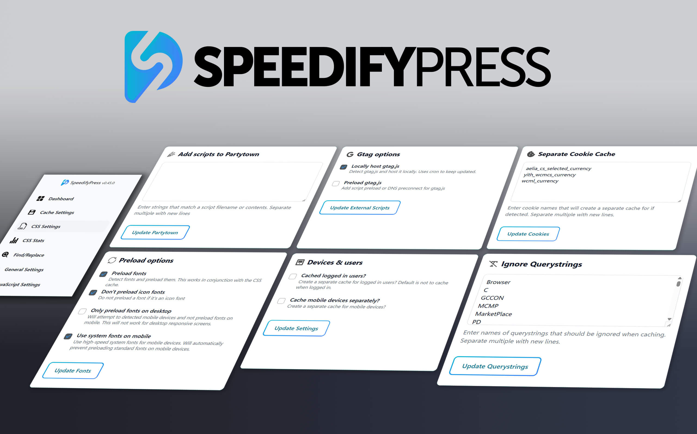

# SpeedifyPress - Real-World WP Speed, Engineered for Pros

SpeedifyPress is a performance optimization toolkit for WordPress, built for developers and agencies who need real-world speed and precision control. Combining advanced techniques with practical configurability, SpeedifyPress goes beyond typical plugins to deliver fast, scalable, and reliable results — all without compromising compatibility or flexibility. From smart unused CSS handling to Cloudflare-ready caching, it's your personal speed stack, engineered for you.

# 🔑 Key Capabilities

- **Unused CSS Handling (Done Right)**  
  Smart removal of unused CSS with a custom approach that avoids common pitfalls of other solutions.

- **Advanced Page Caching**  
  Cache pages with full support for language/currency plugins, background processing, and seamless Cloudflare integration.

- **Cache All of WooCommerce**  
  Cache WooCommerce without worrying about nonces and hardcoded user info. Even works on the cart and checkout pages. 

- **Cache Logged In Users**  
  The cache works even for logged in users with dynamic information on the page. Yes, really. 

- **JavaScript Delay**  
  Delay JavaScript for better performance — with fine-tuned control for real-world use cases. You'll get this working for all sites. 

- **Local Google Analytics (gtag.js)**  
  Serve Google Analytics locally for faster load times and better privacy.

- **Image Lazyloading + Preload**  
  Lazyload images with a custom preloader and automatically preload your LCP image for faster perceived load.

- **HTML Lazyloading**  
  Defer rendering of below-the-fold HTML for a faster initial paint.

- **HTML Find/Replace**  
  Modify your site's HTML on-the-fly with advanced find/replace rules — ideal for agency or power users.

- **Cloudflare Worker Script**  
  Use a custom Cloudflare Worker for intelligent, edge-level caching — with an easy way to clear the cache.

- **Expert Font Loading**  
  Automatically preload the right fonts and fall back to fast system fonts on mobile where appropriate.

## ⚡ Quick Start

1. **Download SpeedifyPress**  
   Simply download the zip from this repository or from [https://speedifypress.com/license/free/](https://speedifypress.com/license/free/)

2. **Install the Plugin on Your WordPress Site**  
   - Log in to your WordPress dashboard  
   - Go to **Plugins → Add New → Upload Plugin**  
   - Upload the `.zip` file and click **Install Now**  
   - Activate the plugin

3. **Access the Dashboard and Register**  
   Once the installation is finished, click "I need a license" in the Dashboard. For single sites, we'll email you a free license. 

4. **Subscribe to the Newsletter**  
   Subscribe for free at the [Adventures in WordPressing Substack](https://adventuresinwordpressing.substack.com/p/speedifypress) to find out how we're using the plugin on real sites. 

5. **Enjoy the Speed**  
   Your site is now equipped with professional-grade optimization tools — faster load times, improved performance scores, and happier users.
## 📝 Documentation & Support

Full documentation and support info is available [here](https://github.com/SpeedifyPress/SpeedifyPress/blob/main/SUPPORT.md).
## 📸 Screenshots

  

    
  

  

    
  

  

    
  

  

    
  

  
## 📝 License

SpeedifyPress is licensed under the **GNU General Public License v2.0 or later (GPL)**.  
You are free to use, study, modify, and redistribute the source code under the terms of the GPL.

### Free Plan

The code is GPL licensed. You are free to modify it as you like. However, we would like to be able to contact you with essential version and security information. We therefore lock
plugin activaton behind a free subscription, requiring an email address. This gives you:

- Access to all the plugin features except the Cloudflare integration (which isn't included in this repo)
- A single site license

Of course, you're free to modify the code if you'd prefer not to use a subscription.

### Paid Plan

A paid subscription unlocks:

- Access to all the plugin features including the Cloudflare integration
- An unlimited site license
- Personal installation and configuration support  
- Find out more at [https://speedifypress.com/go-pro](https://speedifypress.com/go-pro)

> ⚠️ While the GPL allows code redistribution and modification, unlocking features requires a valid subscription.  
> The locking mechanism is designed to encourage support and continued development, but it does not restrict your legal rights under the GPL.
